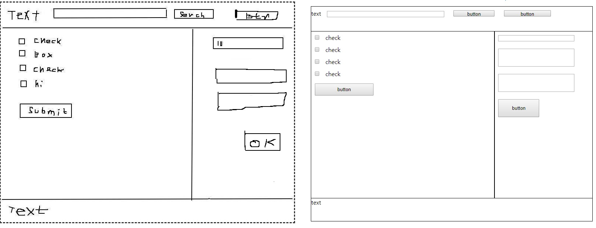

# Sketch2HTML
* Demo web application for converting a hand-drawn sketch 2 html code
* The converting module is now actively being developed.

* Left: Sketch, Right: Auto-generated Web page
 


* Auto-generated HTML code

```html
<html>
<head>
<link rel=stylesheet type=text/css href="sketch2html_result_1523510698424.css" /></head>
<body>
	<div id="div0">
	text
	<input type="text" id="editText3""/>
	<input type="button" id="button3" value="button"/>
	<input type="button" id="button2" value="button"/>
	</div>
	<div id="div1">
		<div id="div2">
		<input type="checkbox" id="checkBox3""/><label> check
		<br>
		<input type="checkbox" id="checkBox2""/><label> check
		<br>
		<input type="checkbox" id="checkBox1""/><label> check
		<br>
		<input type="checkbox" id="checkBox0""/><label> check
		<br>
		<input type="button" id="button1" value="button"/>
		</div>
		<div id="div3">
		<input type="text" id="editText2""/>
		<br>
		<input type="text" id="editText1""/>
		<br>
		<input type="text" id="editText0""/>
		<br>
		<input type="button" id="button0" value="button"/>
		</div>
	</div>
	<div id="div4">
	text
	</div>

</body>
</html>
```

# How to run
* $ pip install -r requirements.txt
* $ python app.py
* Open http://127.0.0.1:5000 in your web browser

# Model's Weights
* You need the model's weights file to run
* To train the model, run
* $ model model_frcnn
* [Pre-trained model file](https://goo.gl/J3NMsj) ( > 100MB)

